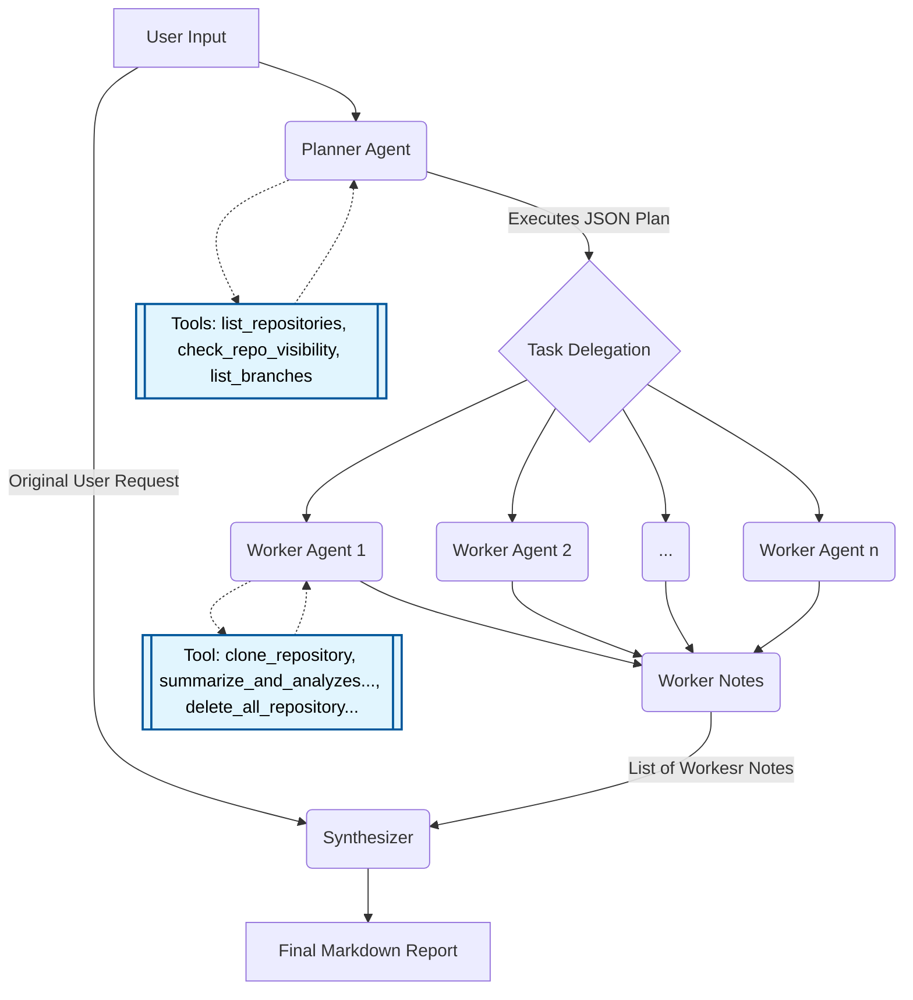

# Github Agent
## Quick Summery
This project is a local, multi-agent GitHub AI assistant built using LangChain and Ollama. It securely interfaces with the GitHub API to access and analyze both your private and public repositories. The core architecture relies on an automated, multi-agent workflow to process user requests, analyze codebases locally, and synthesize comprehensive architectural reports.

## Project Structure
```Plaintext
├── GithubAgent.py
├── tools.py
├── Helper.py
├── prompts/
│   ├── planner_agent.txt
│   ├── worker_agent.txt
│   ├── synthesizer_agent.txt
│   └── global_restrictions.txt
└── .env
```

* `GithubAgent.py`: The main entry point containing the agent flow logic and UI bindings. It orchestrates the full agent workflow, running sequentially from the planner to the worker, and finally to the synthesizer
* `tools.py`: Contains custom tools used by the agent to interface with the GitHub API. It includes functions to list repositories , check visibility , clone repositories to a local temporary directory , and summarize the cloned codebase.
* `Helper.py`: Contains usefull functions like getting full prompt just from prompt name
* `prompts/`: A directory holding all the text-based system prompts utilized by the various agents
* `planner_agent.txt`: Directs the planner agent to analyze the user's request, use tools to discover required repository names, and output a strict, executable JSON plan.
* `worker_agent.txt`: Configures the worker agent as a highly focused code evaluator that analyzes truncated summaries of a codebase.
* `synthesizer_agent.txt`: Instructs the synthesizer to act as a technical document compiler that writes a cohesive Markdown report answering the user's request based only on the worker evaluations.
* `global_restrictions.txt`: Enforces critical behavioral rules, strictly forbidding the agents from debugging code, pointing out bugs, or suggesting code fixes.
* `.env`: Configuration file storing the required GIT_HUB_TOKEN and the target local MODEL name

## Setup & Installation

### 1. Inststall Libraries
Ensure you have Python installed on your machine. Then, install the required packages using the provided requirements file:
```Bash
pip install -r requirements.txt
```
### 2. Setup Ollama & Local LLM
This agent relies entirely on a local Large Language Model to power its reasoning and multi-agent workflow.
* **Download Ollama**: Install Ollama on your machine if you haven't already. Use this link: https://ollama.com/search
* **Install a Reasoning Model**: Open your terminal and pull a local model capable of strong reasoning. I am highly recommending `qwen3.5:latest` Model for this project. Use this following command:
```Bash
ollama run qwen3.5:latest
```
(**Note**: You can choose other local reasoning models from the Ollama library, just ensure you update the MODEL parameter in your .env file accordingly).

* **Verify Operation**: Before executing the GitHub Agent, you must ensure that the Ollama service is actively running in the background on your computer and that the model successfully responds to standard terminal prompts

### 3. Get Fine-Graind Personal Access Token
For this agent and his tools, you would need **Personal Access Token** that you would get from this link: https://github.com/settings/personal-access-tokens
1. **Create New Token**
2. **Give him Name and Description**
3. **Give him Expiration Date**
4. **Give him Repository -> Access All Repositories**
5. **Permissions -> Add Permissions -> Contents -> Read Only** 
6. **Generate Token**
7. **Copy *github_path* Key**

### 4.  Environment Variables
To allow the agent to interface with your GitHub account and know which local model to use, you must create a `.env` ile in the root directory of the project. Include the following two parameters:
```
GIT_HUB_TOKEN=your_github_personal_access_token_here
MODEL=qwen3.5:latest(recommended)
```

### 5. Run the Agent
Once the environment variables are configured, dependencies are installed, and your local model is actively running, you can start the project from your terminal:
```Bash
pytohn GithubAgent.py
```

## Agentic Workflow
This project utilizes a sequential, multi-agent architecture to process user requests safely and efficiently. By dividing the labor, the system ensures the local model does not suffer from context overflow or hallucination. The workflow consists of three distinct agent phases.
### Quick Summery of each Agent:

* **Planner Agent**: Acts as the master technical planner. It receives the user's initial input and uses semantic reasoning to match informal requests (e.g., nicknames) to official GitHub repositories. It outputs a strict, executable JSON plan outlining the exact tasks required.
    * *Connected Tools*: `list_repositories`, `check_repo_visibility`, `list_branches`
* **Worker Agent(s)**: Operating as highly focused code evaluators, these agents execute the steps laid out by the Planner. Depending on the complexity of the plan, n number of worker agents can be initialized to handle different parts of the workload. They analyze truncated summaries of the codebase and are strictly forbidden from debugging, fixing, or writing code.
    * *Connected Tools*: `clone_repository`, `summarize_and_analyzes_cloned_repo`, `delete_all_repository_folders`
* **Synthesizer Agent**: Serves as the final technical document compiler. It gathers the user's original request alongside all the independent evaluation notes generated by the n worker agents. It then synthesizes this raw data into a cohesive Markdown report, focusing purely on structure, architecture, and design comparisons.
    * *Connected Tools*: None

### Workflow Diagram


--------
## Connecting Your Local Agent to My PyQt6 UI
This guide outlines the necessary steps and code structures required to seamlessly connect your local Python agent to the graphical user interface hosted at `Yairb11/UI-for-local-Agents`.
Because the UI application runs using PyQt6, the agent will be executed on a background thread to prevent the interface from freezing. To communicate between the agent's background thread and the main UI thread, you must implement specific functions and use `pyqtSignal`.
### 1. Project Dependencies
For the UI to properly initialize your agent, you must include a `requirements.txt` file in the exact same directory as your main agent file (e.g., `GithubAgent.py`).
Ensure that your `requirements.txt` includes the necessary `PyQt6` library alongside your standard agent dependencies (like `langchain`, `ollama`, etc.).

### 2. Required Imports
At the top of your main agent Python file, you must import the signal class from PyQt6. This is required to pass string updates back to the UI interface.
```python
from PyQt6.QtCore import pyqtSignal
```

### 3. Required Function Implementations
The UI expects three specific functions to exist in your main agent script. These act as the bridge between the frontend application and your backend logic.

* `get_models_name()`: This function is called by the UI to determine which local model the agent is currently utilizing.
```python
def get_models_name():
    # Return the model name used in this agent (e.g., from your .env file)
    pass
```
* `get_prompts_list()`: The UI uses this to display or access the agent's system prompts. It must return a list of local file paths pointing to the text files used by your agents.
```python
def get_prompts_list():
    # Return a list of all local paths to each prompt used
    pass
```
* `run_full_agent()`: This is the main orchestrator function triggered by the user in the UI. It handles the entire agent workflow and accepts the user's input alongside three optional PyQt6 signals.
```python
def run_full_agent(user_prompt: str, thinking_signal: pyqtSignal = None, processing_signal: pyqtSignal = None, outputing_signal: pyqtSignal = None):
    # Core agent logic goes here
    pass
```

### 4. Understanding PyQt6 Signals
Because the `run_full_agent` function runs on a background thread, it cannot directly modify the UI. Instead, it must emit strings through the provided `pyqtSignal` objects. All signals expect a string input (`pyqtSignal(str)`)
* `thinking_signal`: Use this signal to stream the internal reasoning or "thought process" of the agent in real-time.
* `processing_signal`: Use this signal to broadcast status updates to the user so they know what phase the agent is currently executing (e.g., "Planner agent is generating tasks..." or "Worker agent is analyzing cloned repo...").
* `outputing_signal`: Use this signal to stream the final, synthesized response (like the final Markdown report) back to the main chat window.

**Example Usage Inside the Agent**:
```python
def show_text(text, signal:pyqtSignal = None, override = False):
    if not signal:
        if override:
            print(text)
            return
        print(text, end="", flush=True)
        return
    signal.emit(text)
```
```python
...
    for chunk in synthesizer_llm.stream(synthesizer_message):
        reasoning = chunk.additional_kwargs.get("reasoning_content", "")
        if reasoning:
            show_text(f"{reasoning}", thinking_signal, False)
...
```


